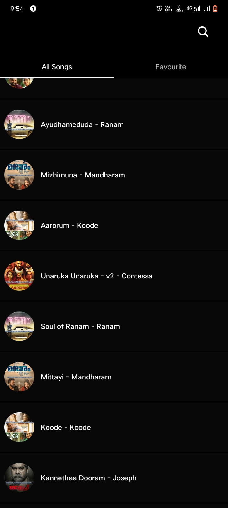
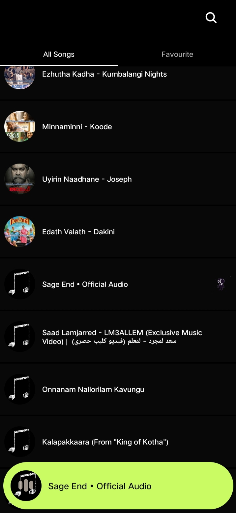
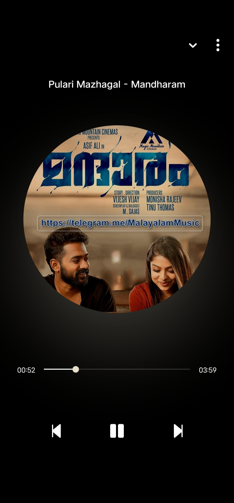

# 🎵 vividMusic  

vividMusic is a powerful and intuitive music player app built with **Expo** and **React Native**. It allows users to search, play, and manage their favorite music seamlessly.  

## ✨ Features  
- **Music Search**: Search for songs using **MongoDB Atlas full-text search**.  
- **Audio Playback**: Play songs with seamless control.  
- **Track Management**: Store metadata like **song name, and cover image**.  

## 🛠 Tech Stack  
- **Frontend**: Expo (React Native)  
- **Backend**: nodejs  
- **Database**: MongoDB Atlas  
- **Storage**: Firebase Storage & Firestore  
- **Streaming & Audio**: Expo Audio, React Native music Player  

## 🤝 Contributing  
Feel free to submit **issues** or **feature requests**to improve vividMusic!  

